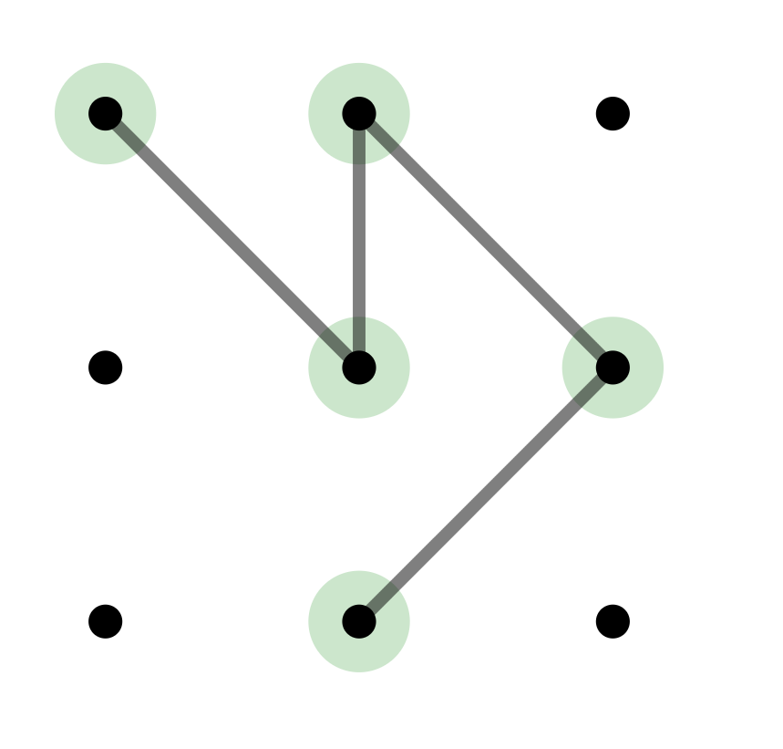
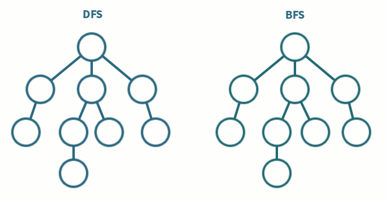
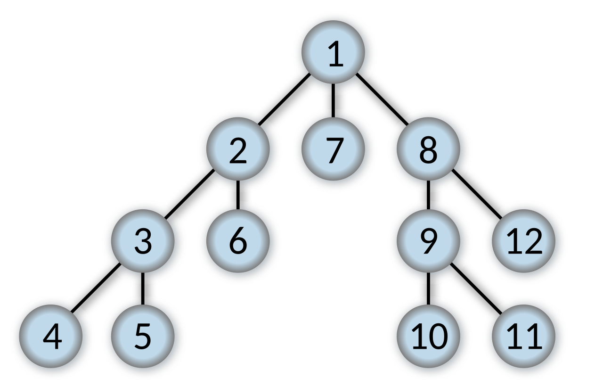

# Brute The Lock


Brute The Lock is an educational Python simulator that demonstrates how Android-style 3×3 pattern locks can be generated, validated, and explored using DFS and BFS search algorithms.
The project was inspired by a discussion about the total number of valid Android lock patterns after hearing a story about someone who had lost access to a 
Bitcoin wallet because they could not remember their pattern. This led to a simple question: how many possible patterns are there, and how would a computer systematically explore them?
The goal of this project is to learn about graph traversal, backtracking, brute-force search, and pattern validation in a visual and interactive way.

---
**The goal is not to bypass real devices, but to understand:**

- graph traversal
- backtracking
- brute-force search
- pattern validation
- GUI visualization

---

## Grid Numbering
Since a computer cannot interpret the visual pattern directly, each dot in the 3×3 grid must be represented by a number. 
This allows the pattern to be stored, processed, and validated using standard data structures and algorithms.

```text
1 2 3
4 5 6
7 8 9
```

## Required Middle Dots
When drawing an Android pattern, some moves are not allowed because another dot lies directly between the starting and destination dots.
For example, when moving from **1** to **3**, the dot **2** visually blocks the connection. A user can clearly see that the line passes through dot **2**, so Android requires that dot **2** has already been included in the pattern before the move is allowed.
Humans can recognize this rule visually, but a computer only sees numbers. To make these visual constraints understandable to the algorithm, the project defines a set of **required middle dots**.
If a move crosses another dot, that intermediate dot must already be present in the current pattern for the move to be considered valid.

For example:

```text
1 - 2 - 3
```

A direct move from **1** to **3** requires **2** to have been visited previously.

Instead of hard-coding every possible case, the project stores these constraints in a dictionary that maps a pair of dots to the required intermediate dot:

```python
REQUIRED_MIDDLE_DOT = {
    (1, 3): 2,
    (3, 1): 2,
    (1, 7): 4,
    (7, 1): 4,
    (3, 9): 6,
    (9, 3): 6,
    (7, 9): 8,
    (9, 7): 8,
    (1, 9): 5,
    (9, 1): 5,
    (3, 7): 5,
    (7, 3): 5,
    (2, 8): 5,
    (8, 2): 5,
    (4, 6): 5,
    (6, 4): 5,
}
```

During validation, the algorithm checks whether a move has a required middle dot. If it does, the move is only allowed when that middle dot already exists in the current pattern.

---

## BFS vs DFS Algorithms



The difference between the two solving methods in the `PatternSolver` class is how they explore the possible pattern combinations.
Both algorithms generate valid Android Pattern Lock sequences, but they search through the pattern space in a different order.

### DFS Solving Method


DFS stands for **Depth-First Search**.

The DFS solver goes as deep as possible into one pattern before trying another branch. This means it keeps adding valid dots to the current pattern until it reaches the maximum length, then it backtracks and tries a different path.

For example, DFS may explore patterns like this:

```text
[1]
[1, 2]
[1, 2, 3]
[1, 2, 3, 4]
[1, 2, 3, 4, 5]
...
```

This approach is naturally implemented with recursion. Each recursive call receives a new pattern and continues expanding it until no more valid moves are available or the maximum pattern length is reached.

### BFS Solving Method

BFS stands for **Breadth-First Search**.
The BFS solver explores patterns level by level. Instead of going deep into one pattern immediately, it first generates all shorter patterns before moving on to longer ones.

For example, BFS explores patterns like this:

```text
Length 1:
[1]

Length 2:
[1, 2]
[1, 4]
[1, 5]

Length 3:
[1, 2, 3]
[1, 2, 4]
[1, 2, 5]
...
```

This approach is implemented with a queue. Patterns are added to the end of the queue and processed from the front, which ensures that older, shorter patterns are expanded first.

### Main Difference

DFS goes **deep first**:

```text
1 → 2 → 3 → 4 → 5
```

BFS goes **wide first**:

```text
[1]
[1, 2] [1, 4] [1, 5]
[1, 2, 3] [1, 2, 4] [1, 2, 5]
```

In this project, DFS is useful for quickly exploring complete patterns, while BFS is useful for generating patterns in order of length, such as all 4-dot patterns first, then all 5-dot patterns, and so on.

## The Visualisation

This application uses Tkinter to draw and simulate the solver visually.